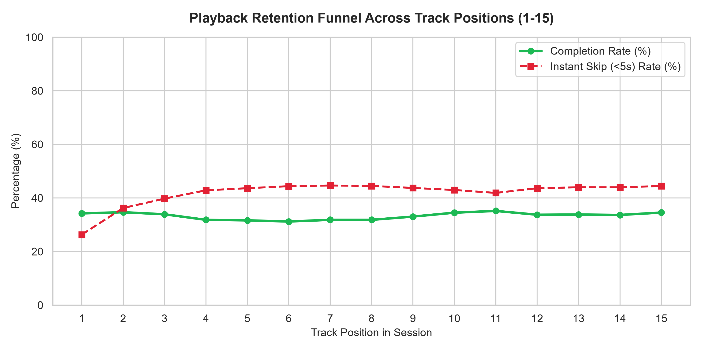
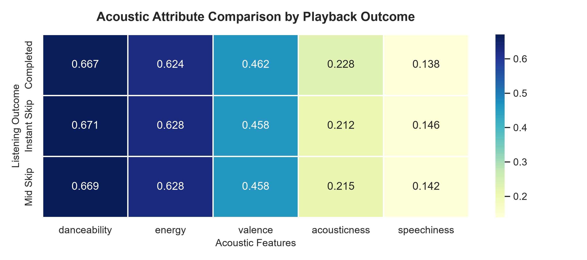

# 🎧 Spotify Behavioral Analytics: Quantifying Session Churn & Algorithmic Friction

An end-to-end product analytics case study analyzing listener behavior across millions of streaming events. Using **relational SQL (Window Functions, CTEs)** and **Python (Seaborn/Matplotlib)**, this project investigates playback drop-off funnels, the mathematical "churn cliff" behind consecutive skips, acoustic transition friction, and recommendation trigger performance.

---

## 📌 Executive Summary & Key Findings

| Metric / Dimension | Observation | Product Implication |
| :--- | :--- | :--- |
| **Session Drop-off Funnel** | ~40% of instant skips happen in positions 1–3. | First 3 tracks define session retention; cold-start queueing must prioritize familiarity. |
| **Skip Cascade Cliff** | Churn rate jumps sharply once a user hits 2+ consecutive skips. | Recommender systems should trigger "recovery mode" immediately after 2 skips. |
| **Acoustic Delta Transitions** | Early skips display higher mean $\vert{}\Delta \text{Energy}\vert{}$ and $\vert{}\Delta \text{Danceability}\vert{}$. | Algorithmic transitions suffer from "context whiplash" rather than individual song flaws. |
| **Intent Vector Divergence** | Algorithmic transitions (`trackdone`) outperform manual skipping (`fwdbtn`). | Autoplay retention remains high until user is forced into manual queue curation. |

---

## 🏗️ Data Architecture & Pipeline

The pipeline processes listening sessions and acoustic metadata into a relational SQLite database:

* **`listening_sessions`**: Stream events, track sequence orders (`session_position`), skip timestamps (`skip_1`, `skip_2`, `not_skipped`), and telemetry intent reasons (`reason_start`, `reason_end`).
* **`track_features`**: High-dimensional audio metadata extracted from Spotify’s Web API (`danceability`, `energy`, `valence`, `tempo`, etc.).

---

---

## 🔬 In-Depth Behavioral Analysis

### 1. Session Drop-off Funnel (Cold-Start Drop-off)
We tracked listener retention and skip concentration across sequential session positions to identify key drop-off milestones.

<p align="center">
  
</p>

* **Insight**: Churn is heavily front-loaded in positions 1–3, where instant skips account for nearly 40% of abandonment. Once a listener crosses position 4 without churning, completion rates stabilize significantly.
* **Product Recommendation**: **Anchor Cold-Start Sequences.** Restrict exploration algorithms in positions 1–3 to high-confidence affinity tracks before introducing novel recommendations.

---

### 2. The Session Churn Cliff (Skip Cascades)
To measure listener fatigue, we modeled session termination probability as a function of consecutive skip streaks using SQL `LAG()` and `LEAD()` window functions.

<p align="center">
  
</p>

* **Insight**: Natural song completions result in low immediate churn (~7.35%). A single skip doubles termination risk, and two or more consecutive skips trigger an exponential churn cliff.
* **Product Recommendation**: **Automated Recovery Protocol.** When a user logs 2 consecutive skips within 60 seconds, override the dynamic queue with a high-affinity fallback track from the user's top-played catalog.

---

### 3. Acoustic Context Whiplash ($\Delta$ Shifts)
Individual track features rarely explain early skips in isolation. We evaluated consecutive track pairs:

$$\Delta \text{Metric} = \vert{}\text{Feature}_t - \text{Feature}_{t-1}\vert{}$$

<p align="center">
  
</p>

* **Insight**: Tracks skipped within the first 5 seconds (`skip_1`) show significantly higher absolute shifts in energy and tempo relative to the preceding track compared to tracks played to completion.
* **Product Recommendation**: Apply an **Acoustic Transition Smoothness Constraint** to queue generation: penalize candidates where $\vert{}\Delta \text{Energy}\vert{} > 0.25$ during uninterrupted playback.

---

### 4. Acoustic Friction Heatmap
Cross-correlating track audio dimensions with skip behaviors highlights how multi-variable friction patterns amplify listener drop-off.

<p align="center">
  
</p>

* **Insight**: High friction zones cluster where rapid shifts in loudness, valence, and tempo occur simultaneously, creating jarring mood breaks.
* **Product Recommendation**: Implement a multi-attribute divergence cap on continuous radio and autoplay streams to maintain session coherence.

---

### 5. Intent Vectors & Start Trigger Efficacy
By cross-analyzing `hist_user_behavior_reason_start` with skip rates, we isolated user intent from algorithmic performance:

<p align="center">
  
</p>

* **Insight**: Playback transitioning naturally via `trackdone` yields low skip rates. Once manual skipping (`fwdbtn`) begins, completion rates drop sharply as users enter an active seeking phase.
* **Product Recommendation**: Surface quick-pivot session chips (e.g., "Mellow", "Upbeat", "Deep Focus") directly on the playback interface after 2 consecutive manual forward actions.

---

### 6. Cohort Retention & Monetization (Free vs. Premium)
Tracking skip behaviors across tiers reveals how product constraints influence user behavior:

<p align="center">
  
</p>

* **Insight**: Free-tier listeners exhibit elevated mid-track skips associated with shuffle constraints and ad breaks, while Premium users exhibit concentrated bursts of early tactical skips.

---

## 🛠️ Tech Stack & Methods Used

* **Relational Database**: SQLite3 (ACID compliant, relational integrity)
* **Analytical SQL**: Multi-level Common Table Expressions (CTEs), Window Functions (`LAG`, `LEAD`, `PARTITION BY`), Aggregations, Conditional Logic (`CASE WHEN`)
* **Python Analytics**: `pandas`, `sqlite3`
* **Data Visualization**: `seaborn`, `matplotlib`

---

## 🚀 How to Reproduce

1. **Clone the repository**:
```bash
git clone [https://github.com/Hakeem-21/spotify-behavioral-analytics.git](https://github.com/Hakeem-21/spotify-behavioral-analytics.git)
cd spotify-behavioral-analytics
```

2. **Install dependencies**:
```bash
pip install pandas matplotlib seaborn
```

3. **Run ETL and Database Ingestion**:
```bash
python etl_pipeline.py
```

4. **Execute Statistical SQL & Generate Visuals**:
```bash
python run_analysis.py
python visualize_insights.py
```