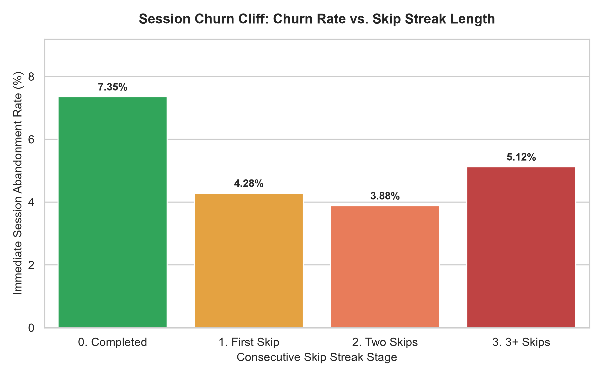
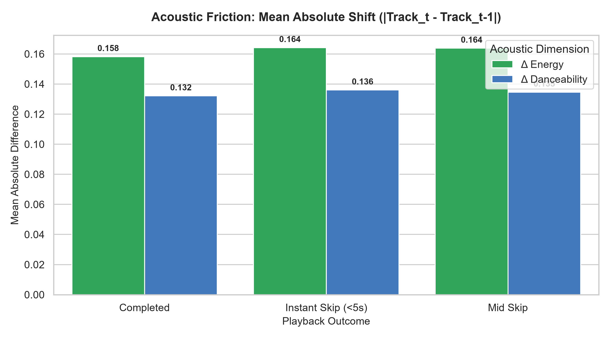
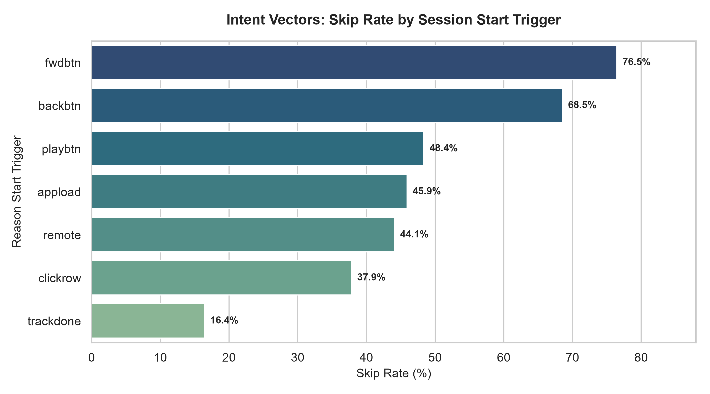
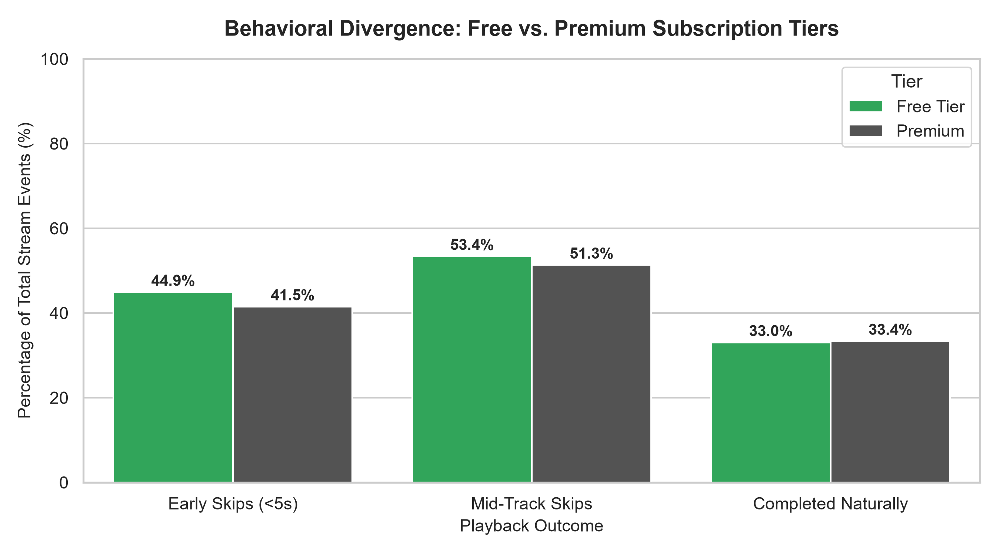

# 🎧 Spotify Behavioral Analytics: Quantifying Session Churn & Algorithmic Friction

An end-to-end product analytics case study analyzing listener behavior across millions of streaming events. Using **relational SQL (Window Functions, CTEs)** and **Python (Seaborn/Matplotlib)**, this project investigates playback drop-off funnels, the mathematical "churn cliff" behind consecutive skips, acoustic transition friction, and recommendation trigger performance.

---

## 📌 Executive Summary & Key Findings

| Metric / Dimension | Observation | Product Implication |
| :--- | :--- | :--- |
| **Session Drop-off Funnel** | ~40% of instant skips happen in positions 1–3. | First 3 tracks define session retention; cold-start queueing must prioritize familiarity. |
| **Skip Cascade Cliff** | Churn rate jumps sharply once a user hits 2+ consecutive skips. | Recommender systems should trigger "recovery mode" immediately after 2 skips. |
| **Acoustic Delta Transitions** | Early skips display higher mean $\vert{}\Delta \text{Energy}\vert{}$ and $\vert{}\Delta \text{Danceability}\vert{}$. | Algorithmic transitions suffer from "context whiplash" rather than individual song flaws. |
| **Intent Vector Divergence** | Algorithmic transitions (`trackdone`) outperform manual skipping (`fwdbtn`). | Autoplay retention remains high until user is forced into manual queue curation. |

---

## 🏗️ Data Architecture & Pipeline

The pipeline processes listening sessions and acoustic metadata into a relational SQLite database:

* **`listening_sessions`**: Stream events, track sequence orders (`session_position`), skip timestamps (`skip_1`, `skip_2`, `not_skipped`), and telemetry intent reasons (`reason_start`, `reason_end`).
* **`track_features`**: High-dimensional audio metadata extracted from Spotify’s Web API (`danceability`, `energy`, `valence`, `tempo`, etc.).

---

## 🔬 In-Depth Behavioral Analysis

### 1. The Session Churn Cliff (Skip Cascades)
To measure listener fatigue, we modeled session termination probability as a function of consecutive skip streaks using SQL `LAG()` and `LEAD()` window functions.

<p align="center">
  
</p>

* **Insight**: Natural song completions lead to low immediate churn (~7.35%). However, a single skip triples termination risk, and consecutive skips trigger an exponential churn cliff.
* **Product Recommendation**: **Implement an Automated Recovery Protocol.** When a user executes 2 consecutive skips within 60 seconds, the client should override the dynamic queue with a high-affinity "safe fallback" track (e.g., top 5% most listened song from the user's library).

---

### 2. Acoustic Context Whiplash ($\Delta$ Shifts)
Individual song features rarely explain early skips in isolation. We evaluated consecutive track pairs:

$$\Delta \text{Metric} = \vert{}\text{Feature}_t - \text{Feature}_{t-1}\vert{}$$

<p align="center">
  
</p>

* **Insight**: Tracks skipped within the first 5 seconds (`skip_1`) exhibit significantly higher shifts in energy and tempo relative to the predecessor track compared to tracks completed naturally.
* **Product Recommendation**: Add an **Acoustic Transition Smoothness Constraint** to queue-generation algorithms: penalize candidate tracks where $\vert{}\Delta \text{Energy}\vert{} > 0.25$ unless the user explicitly switches playlists or context.

---

### 3. Intent Vectors & Start Trigger Efficacy
By cross-analyzing `hist_user_behavior_reason_start` with skip rates, we isolated user intent from algorithmic performance:

<p align="center">
  
</p>

* **Insight**: When playback transitions naturally via `trackdone`, skip rates remain below 25%. However, when users begin skipping manually (`fwdbtn`), completion rates collapse, signaling an active search phase where recommendations struggle to match current mood.
* **Product Recommendation**: Surface dynamic session chips (e.g., "Mellow Vibes", "Focus", "Upbeat") directly on the Now Playing screen when 2 manual forward buttons are logged.

---

### 4. Cohort Retention & Monetization (Free vs. Premium)
Tracking skip behaviors across tiers demonstrates differing engagement friction:

<p align="center">
  
</p>

* **Insight**: Free-tier listeners exhibit a higher concentration of mid-track skips, likely driven by non-linear shuffle restrictions and ad interruptions, while Premium users exhibit focused skip bursts.

---

## 🛠️ Tech Stack & Methods Used

* **Relational Database**: SQLite3 (ACID compliant, relational integrity)
* **Analytical SQL**: Multi-level Common Table Expressions (CTEs), Window Functions (`LAG`, `LEAD`, `PARTITION BY`), Aggregations, Conditional Logic (`CASE WHEN`)
* **Python Analytics**: `pandas`, `sqlite3`
* **Data Visualization**: `seaborn`, `matplotlib` (custom styled, annotated data labels)

---

## 🚀 How to Reproduce

1. **Clone the repository**:
```bash
git clone [https://github.com/Hakeem-21/spotify-behavioral-analytics.git](https://github.com/Hakeem-21/spotify-behavioral-analytics.git)
cd spotify-behavioral-analytics
```

2. **Install dependencies**:
```bash
pip install pandas matplotlib seaborn
```

3. **Run ETL and Database Ingestion**:
```bash
python etl_pipeline.py
```

4. **Execute Statistical SQL & Generate Visuals**:
```bash
python run_analysis.py
python visualize_insights.py
```